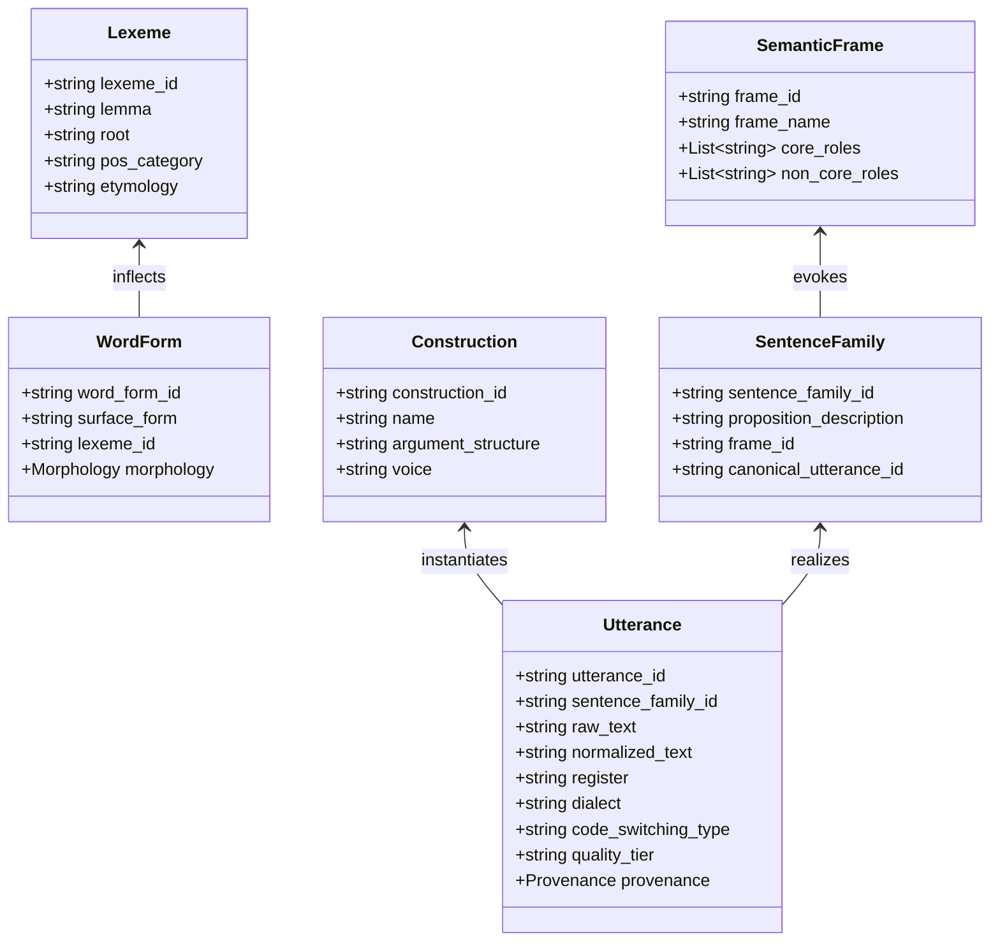

# Data Architecture & Entity Design — BLF

## 1. Overview
The Bangla Language Foundation (BLF) dataset models natural language as a structured hierarchy of linguistic realizations. Rather than storing flat text strings with arbitrary classification labels, BLF establishes explicit entity relations spanning semantics, syntax, morphology, pragmatics, and sociolinguistic variants.

---

## 2. Core Entity Model

---

## 3. Entity Definitions

### 3.1 Lexeme & WordForm
- **Lexeme**: The fundamental abstract unit of lexical meaning (e.g., the verb root `√কর` or lemma `করা`).
- **WordForm**: Concrete morphological realization of a lexeme carrying inflectional features (Tense, Aspect, Person, Politeness, Case, Number, Definiteness, Emphatic/Topic Clitics).

### 3.2 Construction & Semantic Frame
- **Semantic Frame**: Frame-semantic structure capturing events, participants, and conceptual relations (e.g., `Statement`, `Commerce_buy`, `Motion_directional`).
- **Construction**: Grammatical template specifying constituent ordering, voice (Active, Passive, Impersonal, Causative), and argument licensing.

### 3.3 Sentence Family & Utterance
- **Sentence Family**: A conceptual cluster grouping all surface realizations that share an identical semantic core proposition.
- **Utterance**: A specific realization in a given register, dialect, or script variant (e.g., formal standard vs. Sylheti colloquial vs. Banglish transliteration).

### 3.4 Dialogue & Dialogue Turn
- Contextual multi-turn exchanges with explicit speaker intent, speech act classification, and pragmatic implicature.

---

## 4. Multi-Dimensional Annotation Layers

| Layer | Fields Represented |
|---|---|
| **Text & Normalization** | `raw_text`, `normalized_text`, `canonical_bangla`, `english_translation`, `transliteration_banglish` |
| **Pragmatics & Sociolinguistics** | `register` (formal, colloquial, intimate, social), `dialect` (BDSB, Sylheti, Chatgaya, etc.), `formality` |
| **Contact Linguistics** | `code_switching_type` (pure_bangla, loanword, code_switched_latin, romanized_banglish) |
| **Syntax & Morphology** | `lemmas`, `pos_tags`, `morphology_features` (tense, aspect, person, case, voice, polarity) |
| **Semantics** | `semantic_frame`, `semantic_roles`, `named_entities`, `intent` |
| **Quality & Provenance** | `quality_tier` (GOLD, SILVER, SYNTHETIC), `provenance` (source_id, generator, checksum, validation) |
